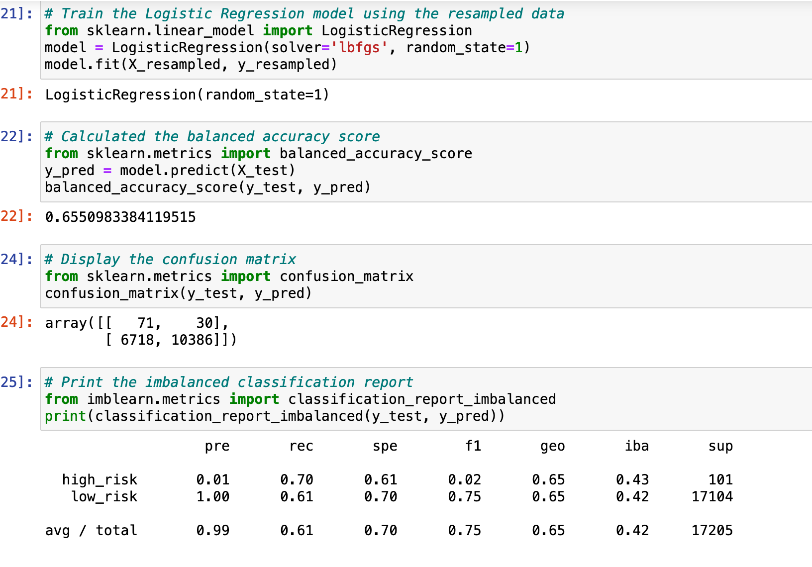
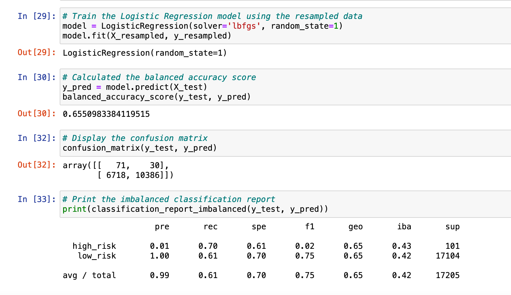
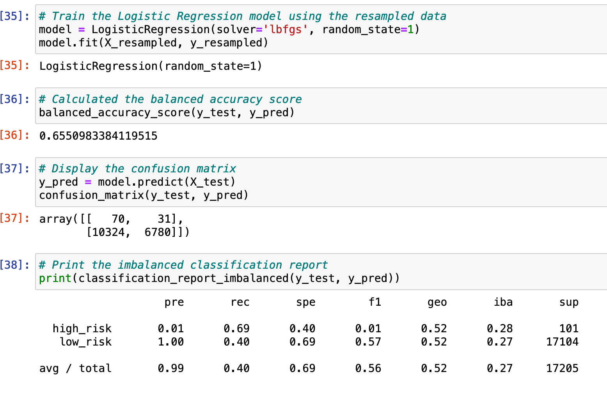
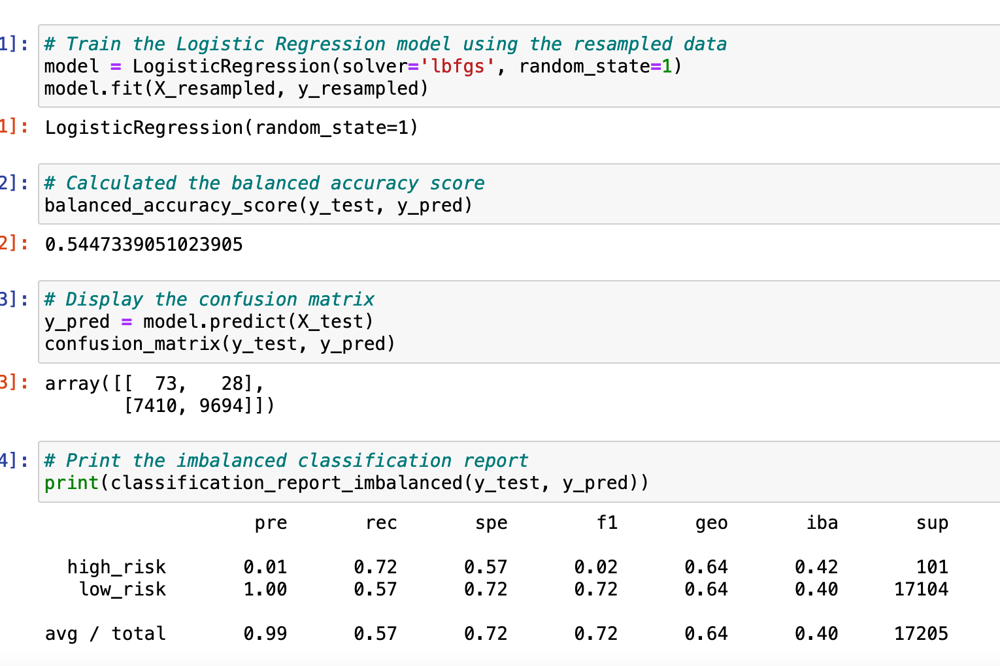
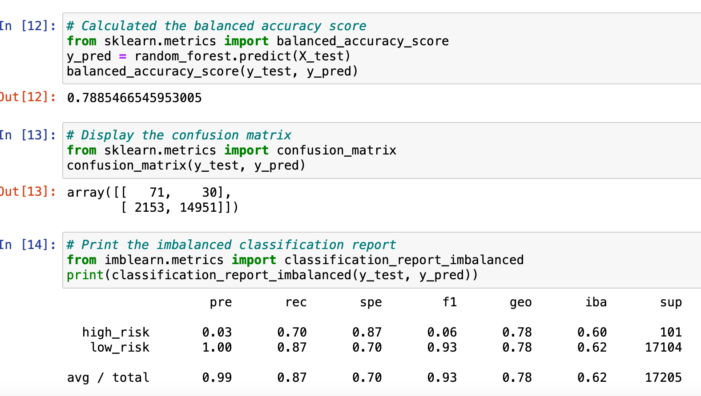
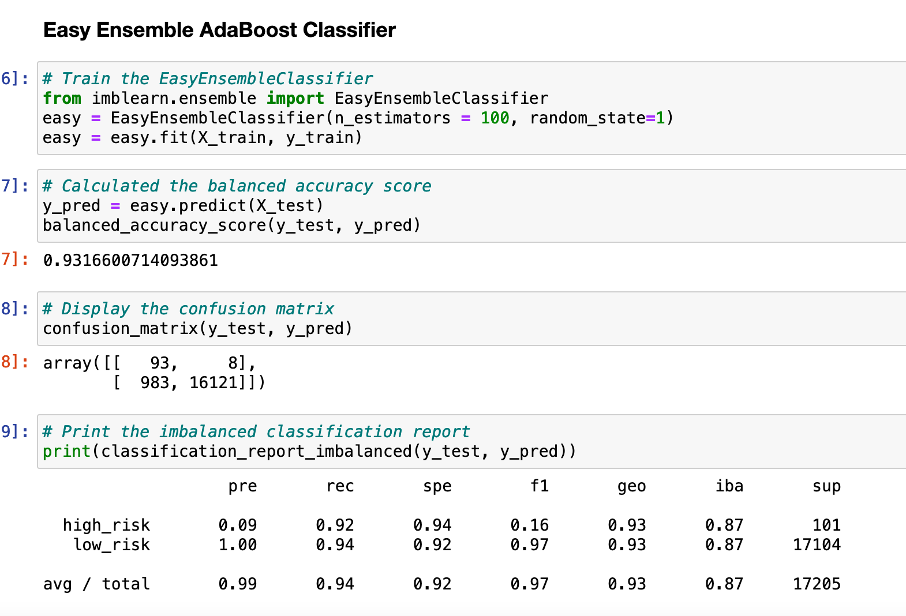

# Predicting Credit Risk

## Fast Lending and Machine Learning
Fast Lending is in need of a machine learning model to predict credit risk--wanting to be able to quickly identify good candidates for loans. Jill has been tasked with training and evaluating machine learning models with unbalanced tasks as credit risk is inherently imbalanced (there are more good candidates than risky candidates).

Results: Using bulleted lists, describe the balanced accuracy scores and the precision and recall scores of all six machine learning models. Use screenshots of your outputs to support your results.

## Results

**- Naive Random Oversampling:** balanced accuracy test is 65%, the precision for the high_risk has positivity of 1% and recall of 70%

**-SMOTE Oversampling:** accuracy score is 65%, the precision for the high_risk has a low positivity of 1% and recall of 70%

**-Undersampling:** balanced accuracy is 65%, the precision is 99% and recall is 40%

**-Oversampling and Undersampling:** balanced accuracy is 54%, the precision is 99% and recall is 57%

**-Balanced Random Forest Classifier:** the accuracy score is 78%, the precision is 97%, and the recall is 87%

**-Easy Ensemble AdaBoost Classifier:** the accuracy score 93%, the precision risk is 91% and the recall is 94%

Summary: Summarize the results of the machine learning models, and include a recommendation on the model to use, if any. If you do not recommend any of the models, justify your reasoning.
## Conclusion
The accuracy score is not as high in the first four models as in our ensemble classifiers and the recall in the oversampling/undersampling model is low as well. Because the ensemble classifiers have a balance of recall and precision, this is my recommendation.The Easy Ensemble has the best balance overall. 
